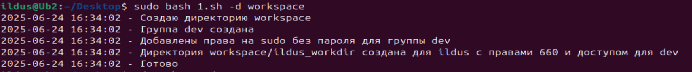
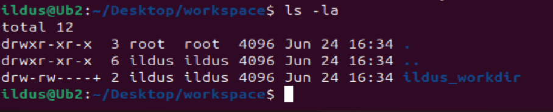

## Задание:

Написать bash скрипт который:
- Создает группу dev в которую добавляются все "не системные" пользователи.
- Группе dev выдаются права на sudo без запроса пароля.
- Для всех пользователей создает директории по маске <user_name>_workdir
- Путь до создаваемых директорий должен задаваться через ключ -d, если ключ не задан, то параметр должен быть запрошен при запуске скрипта
- Создаваемые директории должны быть с правами 660, владелец - пользователь, группа - группа пользователя.
- Для всех созданных директорий должен быть прописан в доступ "чтение" для группы dev.
- Весь лог должен писаться и в stdout и в файл.

## Скрипт
```
#!/bin/bash

LOGFILE="dev_setup.log"

log() {
  echo "$(date '+%Y-%m-%d %H:%M:%S') - $1" | tee -a "$LOGFILE"
}

while getopts ":d:" opt; do
  case $opt in
    d) BASE_DIR="$OPTARG" ;;
  esac
done

if [ -z "$BASE_DIR" ]; then
  read -rp "Введите путь до директории, где будут созданы рабочие папки: " BASE_DIR
fi

if [ ! -d "$BASE_DIR" ]; then
  log "Создаю директорию $BASE_DIR"
  mkdir -p "$BASE_DIR"
fi

if ! getent group dev > /dev/null; then
  groupadd dev
  log "Группа dev создана"
else
  log "Группа dev уже существует"
fi

echo "%dev ALL=(ALL) NOPASSWD:ALL" > /etc/sudoers.d/dev
chmod 440 /etc/sudoers.d/dev
log "Добавлены права на sudo без пароля для группы dev"

getent passwd | awk -F: '$3 >= 1000 && $1 != "nobody" {print $1}' | while read -r user; do
  usermod -aG dev "$user"
  user_dir="${BASE_DIR}/${user}_workdir"

  mkdir -p "$user_dir"
  chown "$user:$user" "$user_dir"
  chmod 660 "$user_dir"
  setfacl -m g:dev:r-- "$user_dir"

  log "Директория $user_dir создана для $user с правами 660 и доступом для dev"
done

log "Готово"

```

## Запуск скрипта


## Созданные папки и доступ


