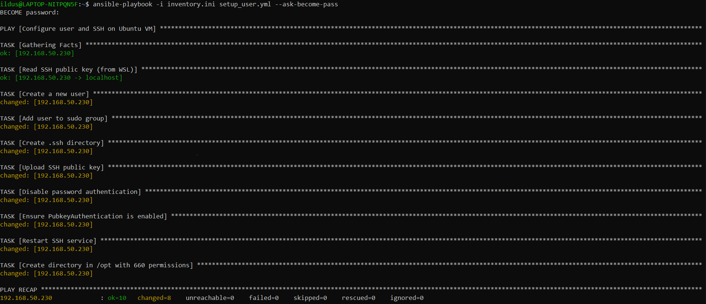
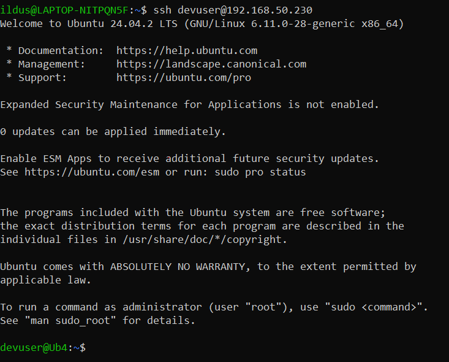
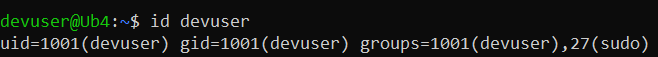
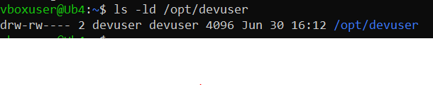

## Homework 2 

### Задание по Ansible:

Написать playbook который должен будет:
- Создать пользователя на удаленной машине.
- Дать пользователю права sudo.
- Сделать авторизацию ssh по ключам для пользователя.
- Отключить авторизацию по паролю при ssh подключении.
- Создать директорию в /opt/ с правами 660 для пользователя.

### Выполнение 
Запуск плейбука 

Авторизация по ключам 

Созданный пользователь(справами sudo)

Директория opt
